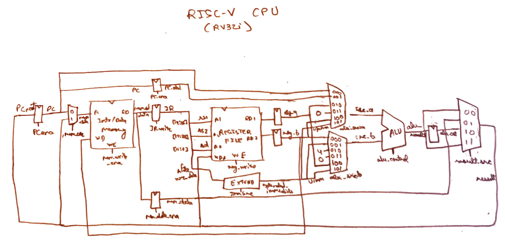

# Multicycle RISC-V CPU - Core Design

The implementation of the RISC-V CPU rv32i (integer subset of RISC-V spec) system with a multicycle core.

Designed by Sparsh Gupta as the final project for Computer Architecture class at Olin College of Engineering - Fall 2023.

##  Instructions Supported

### R-types
- [x] add
- [x] sub
- [x] xor
- [x] or
- [x] and
- [x] sll
- [x] srl
- [x] sra
- [x] slt
- [x] sltu
      
### I-types
- [x] addi
- [x] xori
- [x] ori
- [x] andi
- [x] slli
- [x] srli
- [x] srai
- [x] slti
- [x] sltiu
      
### Memory-Types (Loads/Stores)
- [x] lw
- [x] sw
- [x] *lb*
- [x] *lh*
- [x] *lbu*
- [x] *lhu*
- [x] *sb*
- [x] *sh*

### B-types (Branches)
- [x] beq
- [x] bne
- [x] *blt*
- [x] *bge*
- [x] *bltu*
- [x] *bgeu*
      
### J-types (Jumps)
- [x] jal
- [x] jalr (technically an i-type)
      
### U-types (Upper immediates)
- [x] *lui*
- [x] *auipc*

### Pseudo-Instruction
- [x] *li*

## Setup

**Please skip if you already have a setup_cafe() env configured on your machine.**

You will need a machine/VM using Linux to simulate this CPU. 

Make sure you have OSS-cad-suite-linux-x64 installed. You can obtain it here: https://www.opensourceagenda.com/projects/oss-cad-suite-build#Installation

Obtaining Xilinx version 2023.1 and AMD Vivado would also be helpful. (https://www.xilinx.com/support/download.html)

If you have already completed the above steps, then setting up an environment for these tools is recommended. If you already have an env, make sure it is enabled when simulating the CPU and if you do not, you can set up an env by editing your `~/.bashrc` file. 

```bash
function setup_cafe(){
  # Enable open source tools.
  source ~/embedded/oss-cad-suite/environment

  # Enable Xilinx.
 	export XILINX_INSTALL_PATH="${HOME}/embedded/xilinx/"
  VERSION="2023.1"
  export VIVADO_PATH=${XILINX_INSTALL_PATH}/Vivado/${VERSION}/
  export PATH="${VIVADO_PATH}/bin:$PATH"
  # Setup variables for synthesis. You may need to change this based on your FPGA board.
  export FPGA_PART=xc7a35tcpg236-1
  export PS1="☕ $PS1"
}

# Uncomment this if you aren't using this Linux install for any other projects.
# setup_cafe;
```

Make sure you are in this `submission` directory, then run `./rv32i/tools/check_install` to check whether you have all the necessary dependencies installed and ready.

Once you have all this setup, configure your pwd to `~/submission/rv32i`. Next, just enter the command `setup_cafe()` or start your personal configured environment. 

## Simulation

Please change your pwd to `~/submission/rv32i/core/` to access the **Makefile** and be in the same directory level (also make sure you have setup_cafe() enabled). The Makefile is capable of testing instructions and generating waveform simulations for the CPU.  

The first thing to be done is to generate the rv32i simulator, which can be done using below. (the CPU won't work if you skip this step, also if the simulator has already been generated, then this step will just make sure it is up to date)
```
make rv32_simulator
```

The rv32i assembly scripts are present in the directory `~/submission/rv32i/asm/` to test out different types of instructions.

For example, to test the `btypes` instructions, simply run the below. This will output the register file state after the operations and will also let you generate waveform simulations for it. The sample register file is also included in the asm (.s) files.
```
make test_rv32_btypes
```
You can test out other instruction types as well once you take a look at the `Makefile`. 

To generate waveforms for simulating the CPU, make sure you have `gtkwave` installed. Then execute the command below.
```
make waves_rv32
```

## General Info

**Components**: The required components to simulate the CPU are all present within the `~/submission/rv32i/core/` directory.

**Filter Files**: The `~/submission/rv32i/filter_files/` directory houses some `.txt` filter files used in translating waves generated by gtkwave and makes it easier to track signals, etc.

**Tools**: Some tools that are used in this project, such as an `assembler` to convert assembly (`.s`) files into CPU-executable (`.memh`), the tool to check install, etc. are present in `~/submission/rv32i/tools/`.

## CPU Schematic

Note: The schematic does not include the control unit and FSM logic and is just a reference I used for wiring the components.



## References

References used in designing this CPU:

- [Official RISC-V Manual](https://riscv.org/wp-content/uploads/2019/12/riscv-spec-20191213.pdf)
- [Digital Design & Computer Architecture RISC-V Edition - Sarah L. Harris and David Harris](https://www.sciencedirect.com/book/9780128200643/digital-design-and-computer-architecture)
